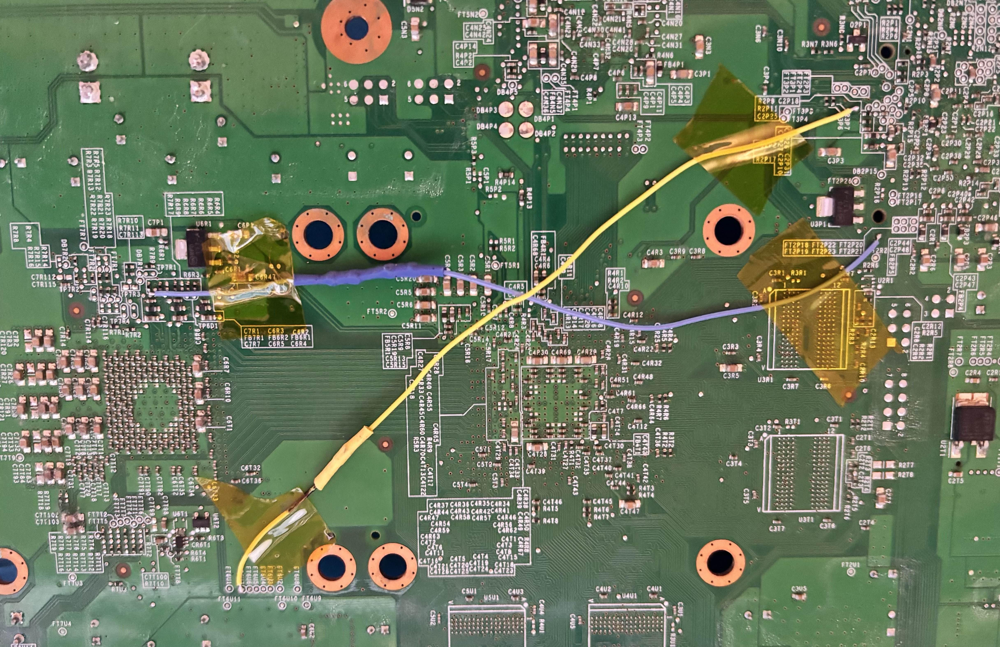

# RGH3
> NOTE: this is for fat motherboards, it is a little different for slim (see source)
RGH3 is a permanent mod using only 2 wires and a hacked NAND

## Downloads
* [J-Runner with Extras](https://github.com/Octal450/J-Runner-with-Extras/releases) Used to make, modify and flash NAND dumps

## Hardware
* [22K Ohm Resistor](https://www.aliexpress.com/item/1005007345052730.html) Goes between our PLL points
* [1n4148 Diode](https://www.aliexpress.com/item/1005006245109375.html) Goes between our POST1 points

## Methods

### RGH3 with Flasher (recommended)
This is the normal method, where a flasher is connected to our NAND to read/write
#### Using PicoFlasher
This uses a [Raspberry Pi Pico](https://www.aliexpress.com/item/1005007359981489.html) for dumping and flashing our NAND

1. Hold down BOOTSEL while plugging the Pico into your computer and copy the [PicoFlasher](https://github.com/X360Tools/PicoFlasher/releases).uf2 file to the Pico

2. Solder the Pico using this diagram:

#### Using other flashers
Connect the flasher with this diagram

#### Dumping our NAND and flashing XeLL
With the flasher setup, we can dump our NAND to create a backup and flash XeLL to get our CPU Key
1. With J-Runner open, give your Xbox power (do not turn it on) and connect your flasher to your computer
2. Press `Read Nand` and make sure you get 2 dumps that are the same
3. Under the XeBuild section, make sure your console is correctly recognised and that the latest kernel is selected. Select `Glitch2`, `RGH` and set MHz to `10` (try `27` if it doesn't work)
4. Press `Create XeLL` to create our XeLL image then `Write XeLL` to flash our XeLL image

#### Soldering the RGH3 mod
Disconnect the Xbox from power and disconnect the flasher from your computer

#### Getting the CPU Key
We can now turn on our Xbox and should boot into XeLL where we can get our CPU Key, copy down the CPU Key and turn the Xbox back off

#### Flashing the hacked image
1. Reconnect the Xbox to power and connect the flasher back to your computer
2. Paste the CPU Key into J-Runner (it will tell you if it's wrong), press `Create XeBuild` then `Write Nand`

Unplug the flasher from your computer and attempt to turn the Xbox on, if everythings went well it should boot in less than 5 seconds

### RGH3 with Bad Update and Simple 360 NAND Flasher (risky)
Instead of using a flasher we can also use Bad Update to get our CPU Key, dump our NAND and flash our NAND. Flashing the NAND WILL brick your Xbox until the RGH3 mod is installed

1. Download [Simple 360 NAND Flasher](https://www.consolemods.org/wiki/File:Simple_360_NAND_Flasher.7z) and put it on your USB alongside [Bad Update](./Bad%20Update.md)
2. Launch Simple 360 NAND Flasher, press X to dump your NAND
3. Plug the USB into your computer and add the dump (`flashdmp.bin`) to J-Runner, your CPU Key should also be added from the `cpukey.txt` file
4. Under XeBuild, select `Glitch`, `RGH3` and `10` MHz
5. Press `Create XeBuild` and copy the output bin file to your USB named `updflash.bin`
6. In Simple 360 NAND Flasher, press A and START to flash your NAND. Your Xbox will now be bricked until the RGH3 mod is installed
7. Solder the RGH3 mod

## Sources
https://xbox360hub.com/guides/rgh-3-guide/